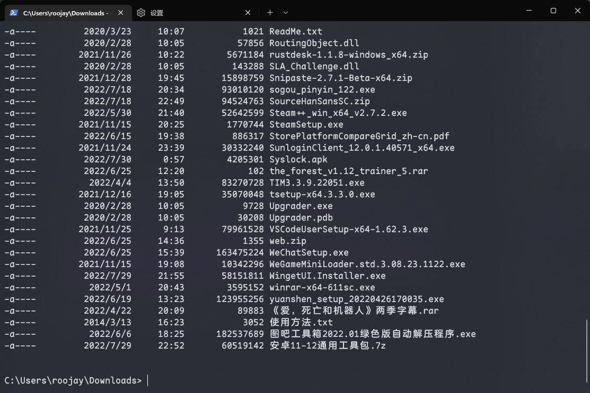
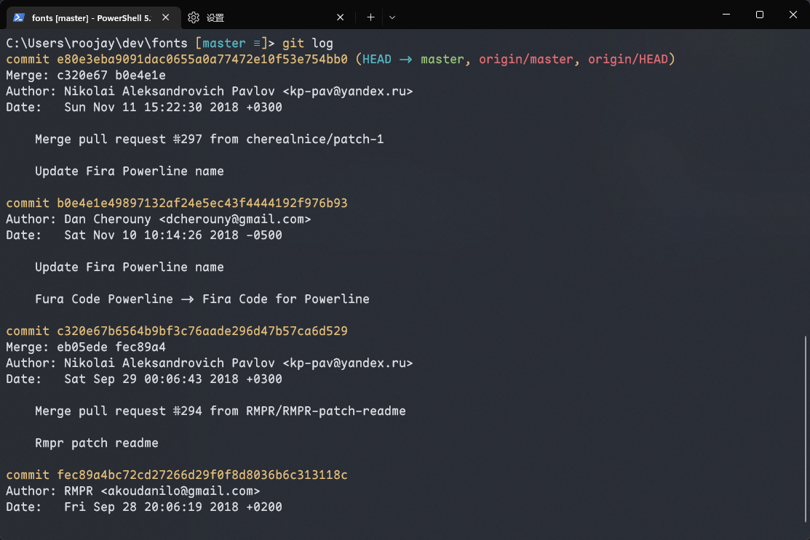

# windows terminal 使用配置
## 安装
  1. 通过 [Gihtub Releases](https://github.com/microsoft/terminal/releases) 下载安装；
  2. 通过 [Microsoft Store](https://apps.microsoft.com/store/detail/windows-terminal/9N0DX20HK701?hl=zh-cn&gl=CN) 直接安装；

## terminal 配置
1. 安装字体，推荐 [MapleMono-SC-NF](https://gitee.com/subframe7536/Maple/releases)
2. 添加主题 Color Scheme [one-dark-windows-terminal]
3. 打开 terminal `设置 > 打开 JSON 文件`，修改 `profiles.defaults` 添加主题和字体配置，修改 `schemes` 添加 [One Dark]((https://github.com/yosukes-dev/one-dark-windows-terminal)) 主题配色；
```json 
{
  "profiles": {
    "defaults": {
      "colorScheme": "One Dark",
      "font": {
        "face": "Maple Mono SC NF"
      },
      "opacity": 80,
      "useAcrylic": true
    }
  },
  "schemes": [{
      "background": "#1E2127",
      "black": "#000000",
      "blue": "#61AFEF",
      "brightBlack": "#5C6370",
      "brightBlue": "#61AFEF",
      "brightCyan": "#56B6C2",
      "brightGreen": "#98C379",
      "brightPurple": "#C678DD",
      "brightRed": "#E06C75",
      "brightWhite": "#FFFFFF",
      "brightYellow": "#D19A66",
      "cyan": "#56B6C2",
      "foreground": "#5C6370",
      "green": "#98C379",
      "name": "One Dark",
      "purple": "#C678DD",
      "red": "#E06C75",
      "white": "#ABB2BF",
      "yellow": "#D19A66"
    },
    {
      "background": "#F9F9F9",
      "black": "#000000",
      "blue": "#4078F2",
      "brightBlack": "#383A42",
      "brightBlue": "#4078F2",
      "brightCyan": "#0184BC",
      "brightGreen": "#50A14F",
      "brightPurple": "#A626A4",
      "brightRed": "#E45649",
      "brightWhite": "#FFFFFF",
      "brightYellow": "#986801",
      "cyan": "#0184BC",
      "foreground": "#383A42",
      "green": "#50A14F",
      "name": "One Light",
      "purple": "#A626A4",
      "red": "#E45649",
      "white": "#A0A1A7",
      "yellow": "#986801"
    }
  ]
}
```

预览如下：



## 安装 git 

1. 根据自己的系统进行下载安装 [git](https://git-scm.com/download/win)；
2. 安装 [posh-git](https://github.com/dahlbyk/posh-git) 优化 PowerShell Git 体验，在 PowerShell 中使用 Git 相关[ 官方说明文档](https://git-scm.com/book/zh/v2/%E9%99%84%E5%BD%95-A%3A-%E5%9C%A8%E5%85%B6%E5%AE%83%E7%8E%AF%E5%A2%83%E4%B8%AD%E4%BD%BF%E7%94%A8-Git-Git-%E5%9C%A8-PowerShell-%E4%B8%AD%E4%BD%BF%E7%94%A8-Git)；

预览如下：
