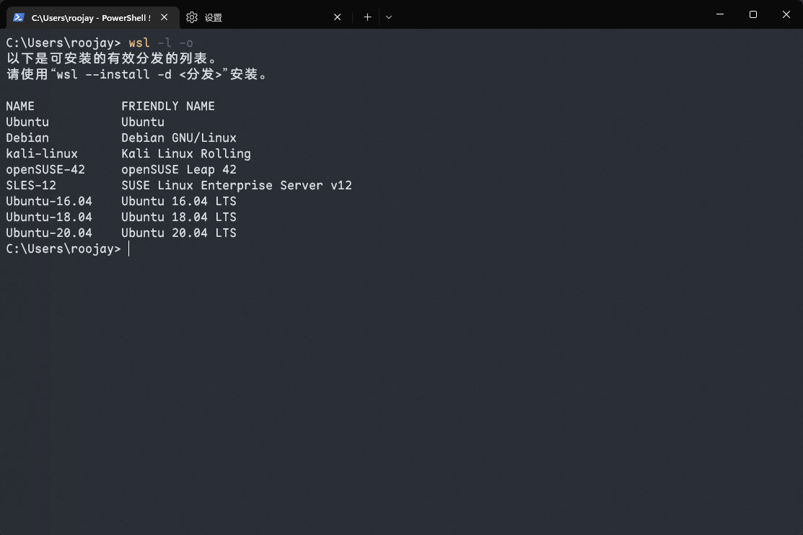
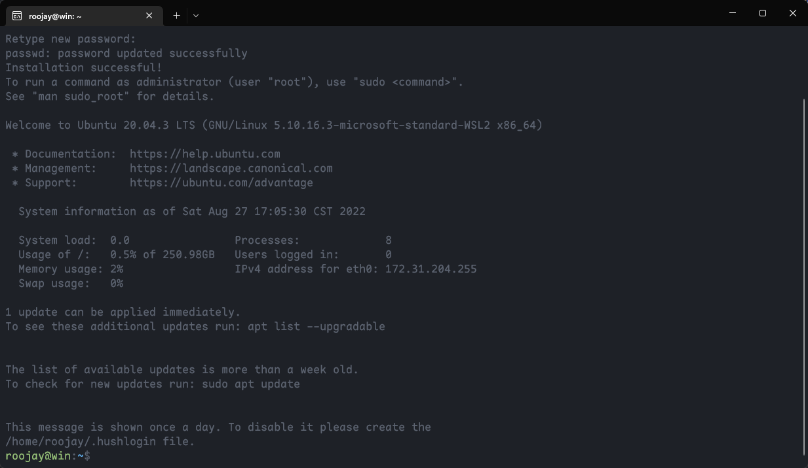

# wsl 安装配置
## 安装 
> 具体安装设置参考 Windows WSL 开发环境配置[https://docs.microsoft.com/zh-cn/windows/wsl/install](https://docs.microsoft.com/zh-cn/windows/wsl/install)
1. 查看 WSL 支持的 Linux 发行版  `wsl -l -o` 
2. 安装 Ubuntu-20.04 发行版 `wsl --install -d Ubuntu-20.04`
3. 等待安装下载完毕设置用户名和密码 

## 配置环境
### 更换国内镜像源
> 这里使用清华 TUNA 的软件源镜像：[Ubuntu 镜像使用帮助](https://mirrors.tuna.tsinghua.edu.cn/help/ubuntu/)

```bash
# 备份源配置
sudo cp /etc/apt/sources.list /etc/apt/sources.list.bak

# 替换 TUNA 源
sudo sed -i "s@http://.*archive.ubuntu.com@https://mirrors.tuna.tsinghua.edu.cn@g" /etc/apt/sources.list
sudo sed -i "s@http://.*security.ubuntu.com@https://mirrors.tuna.tsinghua.edu.cn@g" /etc/apt/sources.list

# 更新软件列表
sudo apt update && sudo apt upgrade
```

### 终端美化 
> 使用 zsh + Oh My Zsh

```bash 
# 安装 zsh 
sudo apt install zsh

# 安装 Oh My Zsh
sh -c "$(curl -fsSL https://raw.githubusercontent.com/ohmyzsh/ohmyzsh/master/tools/install.sh)"

```


### 代理相关
> 直接使用 windows 主机上面的相关代理，需要在代理软里面打开`允许局域网连接`的选项

```bash
# .zshrc
# 在 .zshrc 文件下面添加以下配置，其中端口 7890 根据所使用的代理填写
export hostip=$(cat /etc/resolv.conf |grep "nameserver" |cut -f 2 -d " ") 

function proxy() {
    export all_proxy="http://$hostip:7890"
    echo $all_proxy 
    echo -e "proxy on"
}

function unproxy(){
    unset all_proxy
    echo -e "proxy off"
}
```

```bash 
# 使配置生效
source ~/.zshrc

# 启用代理
proxy

# 检查代理是否生效
curl -I https://google.com

#停用代理
unproxy
```